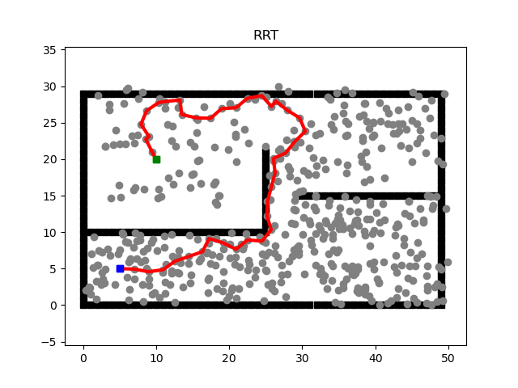
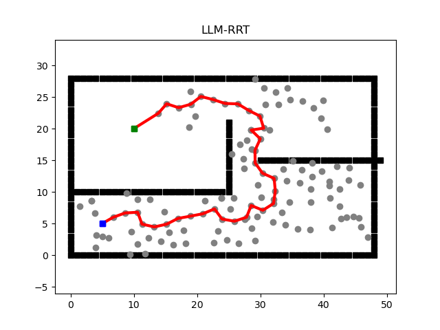

Abstract
------

The increasing demand for autonomous navigation systems has opened new possibilities for optimizing decision-making in dynamic and complex environments. One of the fundamental challenges in this domain is path planning, which involves computing efficient, obstacle-free routes from a starting point to a destination. Traditional path-finding algorithms such as **A*** and **Rapidly-exploring Random Trees (RRT)** have long been employed to solve this problem, ensuring valid paths. However, as the state space expands, these methods encounter substantial computational and memory inefficiencies, highlighting the need for more scalable solutions. Despite recent progress, there remains a critical gap in integrating broader environmental reasoning into path-planning strategies without sacrificing precision.

To address this gap, we propose two hybrid methods: **LLM-A*** and **LLM-RRT** that combine the precise path-finding strengths of A* and RRT with the global reasoning abilities of Large Language Models (LLMs). While **A*** and **RRT** excel at detailed navigation in complex spaces, they struggle with efficiency in large-scale environments. On the other hand, LLMs offer contextual environmental insights but lack the precision required for exact navigation. By incorporating LLMs to approximate the initial direction for sampling, we demonstrate a significant reduction in the computational iterations needed to find efficient paths.

The results, derived from simulations and real-world experiments, show that our hybrid approach improves path-finding efficiency in both time and space complexity, while maintaining path validity even in expansive environments. This novel integration of LLMs with traditional algorithms enhances decision-making accuracy and robustness, moving the field of autonomous navigation forward by paving the way for more intelligent and reliable autonomous systems.

Algorithm
------

<br/>
<p align="center"> 

<br/>
<p align="center"> 

Directory Structure
------

    ./llm-path-finding
    ├── dataset
    │   ├── dataset.py
    │   └── __init__.py
    ├── env
    │   ├── __init__.py
    │   └── search
    │       ├── env.py
    │       ├── __init__.py
    │       └── plotting.py
    ├── __init__.py
    ├── model
    │   ├── chatgpt.py
    │   ├── __init__.py
    │   └── llama3.py
    ├── pather
    │   ├── a_star
    │   │   ├── a_star.py
    │   │   └── __init__.py
    │   ├── __init__.py
    │   ├── llm_a_star
    │   │   ├── __init__.py
    │   │   ├── llm_a_star.py
    │   │   └── prompt.py
    │   ├── llm_rrt
    │   │   ├── __init__.py
    │   │   ├── llm_rrt.py
    │   │   └── prompt.py
    │   └── rrt
    │       ├── __init__.py
    │       └── rrt.py
    ├── utils
    │   ├── filter.py
    │   ├── __init__.py
    │   └── utils.py
    └── version.py

## ⏬ Installation
```bash
pip install -r requirements.txt 
```

## 🚀 Quick Start
Create a '.env' file in the project directory to store the OpenAI API key:

```bash
OPENAI_API_KEY = sk-xxxxxxxxxxxxxxxxxxx
```

Then run:
```bash
python3 main.py
```

## 📝 Citation
If you found this work helpful, please consider citing it using the following:
```
@misc{Jianlin2024,
  author = {Jianlin Ye},
  title = {llm-path-finding},
  year = {2024},
  publisher = {GitHub},
  journal = {GitHub repository},
  howpublished = {\url{https://github.com/JYe9/llm-path-finding}},
  commit = {16865d524e27ff72ea04c28980f2d5be2c456477}
}
```

## 💫 Showcase
<br/>
<p align="center"> 

<br/>
<p align="center"> 

<br/>
<p align="center"> 

<br/>
<p align="center"> 

## 🪪 License
MIT. Check `LICENSE`.


